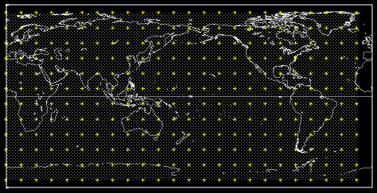
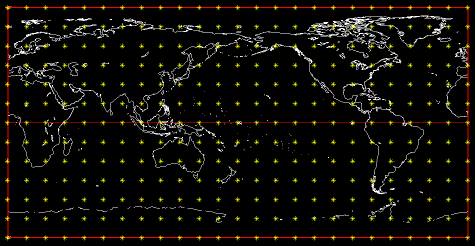
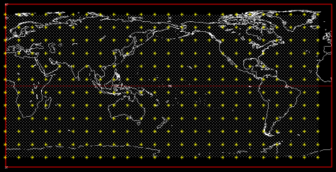
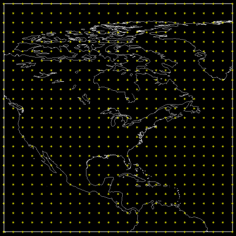
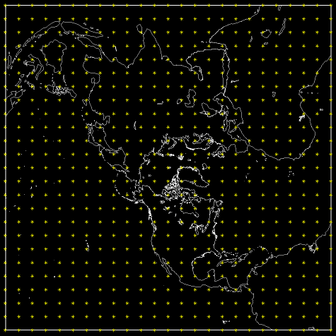
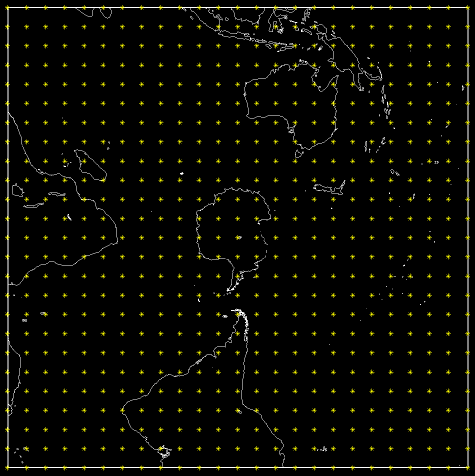
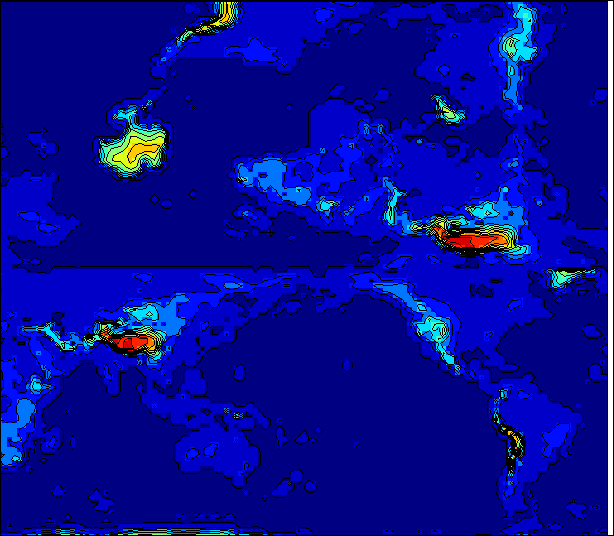
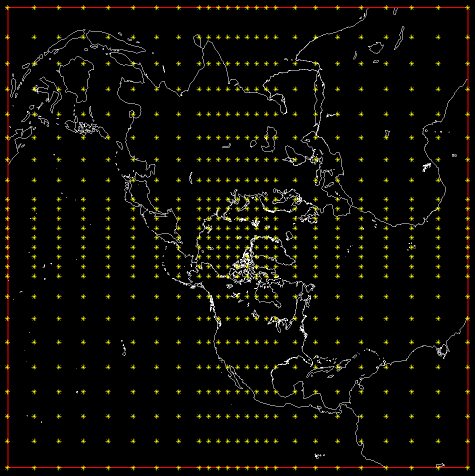
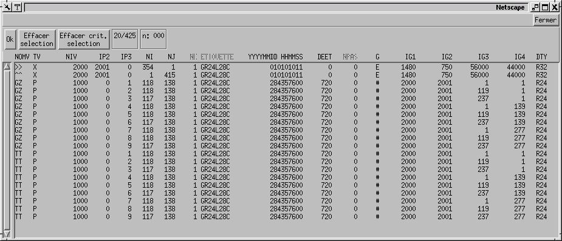

# Grid types supported by rpn standard files

## Conventions regarding the usage of grid descriptors in RPN standard files

In RPN standard files, the geographical location of a grid is defined by the parameters "GRTYP", "IG1", "IG2", "IG3" and "IG4"."GRTYP" is defined as CHARACTER\*1, and IG1 through IG4 are INTEGERs.

The actual convention supports the following grids:

* [A: Global/Hemispheric](#A)
* [B: Global/Hemispheric](#B)
* [E: Global/Local Area Rotated Latlon Grids](#E)
* [G: Global/Hemispheric 'Gaussian'](#G)
* [L: Cylindrical Equidistant (alias lat-lon)](#L)
* [N: North Polar stereographic](#N-and-S)
* [S: South Polar stereographic](#N-and-S)
* [U: Universal](#U)
* [X: Unstructured](#X)
* [Y: Latlon Clouds](#Y)
* [Z: Irregular Cartesian](#Z)
* ['#': Local Area (Tiled)](#\#)

One can also define, in a polar stereographic or lat-lon projection, and within certain limits, a cartesian grid with an irregular mesh (like the one used in the Finite Element model).

Here is the description of the grid types currently supported in RPN standard files. The following convention applies:

* NI: horizontal dimension of the grid
* NJ: vertical dimension of the grid
* in FORTRAN subroutine calls, input arguments are written in lower case, output arguments in capitals.


## A

This is a lat-lon grid covering either an hemisphere or the whole globe. There is no grid point at the pole and at the equator, and the first latitude has an offset of 0.5 grid point. The first longitude is 0deg. (the Greenwich meridian), and is not repeated at the end of the grid. The latitudinal grid length is 180/NJ for a global grid, 90/NJ otherwise. The longitudinal grid length is 360/NI. For such a grid,

* IG1 contains the domain of the grid:
    * 0 Global
    * 1 Northern Hemisphere
    * 2 Southern Hemisphere
* IG2 contains the orientation of the grid:
    * 0 South -> North (pt (1,1) is at the bottom of the grid)
    * 1 North -> South (pt (1,1) is at the top of the grid)
* IG3 should be 0.
* IG4 should be 0.




## B

The 'B' grid is a lat-lon grid covering either an hemisphere or the whole globe. There is a grid point at the pole and at the equator (if the grid is hemispheric or global with NJ odd). The first longitude is 0deg. (the Greenwich meridian), and is repeated at the end of the grid. The latitudinal grid length is 180/(NJ-1) for a global grid, 90/(NJ-1) otherwise. The longitudinal grid length is 360/(NI-1). For such a grid,

* IG1 contains the domain of the grid:
    * 0 Global
    * 1 Northern Hemisphere
    * 2 Southern Hemisphere
* IG2 contains the orientation of the grid:
    * 0 South -> North (pt (1,1) is at the bottom of the grid)
    * 1 North -> South (pt (1,1) is at the top of the grid)
* IG3 should be 0.
* IG4 should be 0.




## E

The 'E' grid is a type of Z grid (E is stored in the positional records) that defines a rotated grid and has a regular structure . A typical application is a record containing values for a set of lat-lon points defined on the rotation of the grid. For such a data set, one must use 2 special "positional" standard file records to define the location of each point: one record holding the horizontal positions of the points, and the other the vertical positions.

The parameter "NOMVAR" of the positional records has to be set to ">>" (an horizontal arrow) and to "^^"(a vertical arrow) for the records containing respectively the vertical and horizontal position of each point.

The "^^" and ">>" records can only be defined on 'Z' grids. The position of the points should be stored in degrees relevant to the reference projection. The longitudes should be between 0 to 360.0, never negative. The latitudes should be between -90 to 90 but not touching the "90"

The IG1..IG4 values of the L grid axes can be set by this call to `CXGAIG`


## G

The 'G' grid is a gaussian grid covering either an hemisphere or the whole globe. This grid is used in the spectral model; it is very much alike the 'A' grid, except that the latitudes are not equidistant. There is no grid point at the pole and at the equator. The first longitude is 0deg. (the Greenwich meridian), and is not repeated at the end of the grid. The longitudinal grid length is 360/NI. For such a grid,

* IG1 contains the domain of the grid:
    * 0 Global
    * 1 Northern Hemisphere
    * 2 Southern Hemisphere
* IG2 contains the orientation of the grid:
    * 0 South -> North (pt (1,1) is at the bottom of the grid)
    * 1 North -> South (pt (1,1) is at the top of the grid)
* IG3 should be 0.
* IG4 should be 0.




## L

The 'L' grid is a cylindrical equidistant grid (alias lat-lon). This grid is defined by the following parameters:

* XLAT0: latitude of the southwest corner of the grid.
* XLON0: longitude of the southwest corner of the grid.
* DLAT: latitudinal grid length in degrees.
* DLON: longitudinal grid length in degrees.

These parameters cannot be encoded directly into IG1, IG2, IG3 and IG4. To set the values of IG1, IG2, IG3 and IG4 from XLAT0, XLON0, DLAT and DLON, the conversion routine `CXGAIG` must be called. The calling sequence is:
```
CALL CXGAIG(grtyp, IG1, IG2, IG3, IG4, xlat0, xlon0, dlat, dlon)

```

Conversly, to get the values of XLAT0, XLON0, DLAT and DLON from IG1, IG2, IG3 and IG4, the conversion routine `CIGAXG` must be called. The calling sequence is:
```
CALL CIGAXG(grtyp, XLAT0, XLON0, DLAT, DLON, ig1, ig2, ig3, ig4)
```

The conversion from real to integer values may cause some loss of precision.

### Precision of descriptors:

* XLAT0, XLON0: 0.01 deg
* DLAT, DLON: 0.001 deg if DLAT, DLON < 1 deg
* 0.01 deg if DLAT, DLON >= 1 and <= 20 deg
* 1.0 deg if DLAT, DLON > 20 and <= 55 deg




## N and S

These grids are polar stereographic; the 'N' grid is defined in the northern hemisphere, the 'S' grid in the southern hemisphere.
These grids are defined by the parameters PI, PJ, D60 and DGRW.

* PI: Horizontal position of the pole, in grid points, from bottom left corner (1,1).
* PJ: Vertical position of the pole, in grid points, from bottom left corner (1,1).
* D60: grid length, in meters, at 60deg. of latitude.
* DGRW: angle (between 0 and 360, +ve counterclockwise) between the Greenwich meridian and the horizontal axis of the grid.

As for the 'L' grid, one must use the routines `CXGAIG` and `CIGAXG` to do the conversion between PI, PJ, D60, DGRW and IG1, IG2, IG3 and IG4.

To set the values of IG1, IG2, IG3 and IG4 from PI, PJ, D60 and DGRW, the routine CXGAIG must be called. The calling sequence is:
```
CALL CXGAIG(grtyp, IG1, IG2, IG3, IG4, pi, pj, d60, dgrw)
```

Conversly, to get the values of PI, PJ, D60 and DGRW, from IG1, IG2, IG3 and IG4, the routine CIGAXG must be called. The calling sequence is:
```
CALL CIGAXG(grtyp, PI, PJ, D60, DGRW, ig1, ig2, ig3, ig4)
```

### Precision of the descriptors:

* D60: 100 meters
* DGRW: 0.01 deg
* PI, PJ: 0.01 of a grid point if PI and PJ are +ve and < 200.

Otherwise, the lat-lon coordinates of the southwestern corner of the grid are kept with an error of about 0.01 deg





# U

In the 'U' grid, it represents the universal grid which can store any type of grid described here, encoded within the special record "^>". For now, we have the Yin-Yang grid which contains 2 concatenated Z grids




# X

In the 'X' grid, the contents of the grid are not related to any geographical location on the earth. The parameters IG1 through IG4 should be set to 0. A typical application would be a theoretical experiment, like the evolution of a bubble in a cylinder.


# Y

The 'Y' grid represents a data set without a regular structure. A typical application is a record containing values for a stream of lat-lon points. For such a data set, one must use 2 special "positional" standard file records to define the location of each point: one record holding the horizontal positions of the points, and the other the vertical positions.

The parameter "NOMVAR" of the positional records has to be set to ">>" (an horizontal arrow) and to "^^"(a vertical arrow) for the records containing respectively the vertical and horizontal position of each point.

The "^^" and ">>" records can only be defined on 'L', 'N' and 'S' grids. The position of the points should be stored in units relevant to the reference projection (degrees or meters). A common practice used to store absolute lat-lon coordinates is to define a lat-lon grid where the southwest corner is positioned at (0.0 deg. lat, 0.0 deg. lon) and where the grid length is 1.0 deg. in both directions.

The IG1..IG4 values of the L grid axes can be set by this call to `CXGAIG`
```
call cxgaig('L', ig1, ig2, ig3, ig4, 0.0, 0.0, 1.0, 1.0)
```

On such a grid, one can read and write the lat-lon values of the data points without further conversions.

The connection between one record and the associated positional records is done by "linking" the IG1, IG2 and IG3 descriptors of the data record to the IP1, IP2 and IP3 descriptors of the positional records. Consider the following example. We have here 2 positional records and 3 data records.

| NOMVAR |   NI   |   NJ   |   IP1  |   IP2  |   IP3  |  GRTYP |   IG1  |   IG2  |   IG3  |   IG4  |
| :----: | -----: | -----: | -----: | -----: | -----: | :----: | -----: | -----: | -----: | -----: |
|   ^^   |     50 |      1 |   1001 |   1002 |   1003 |    L   |    100 |    100 |   9000 |      0 |
|   ^^   |      1 |     10 |   1001 |   1002 |   1003 |    L   |    100 |    100 |   9000 |      0 |
|   GZ   |     50 |     10 |   1000 |     12 |      0 |    Y   |   1001 |   1002 |   1003 |      0 |
|   TT   |     50 |     10 |   1000 |     12 |      0 |    Y   |   1001 |   1002 |   1003 |      0 |
|   ES   |     50 |     10 |   1000 |     12 |      0 |    Y   |   1001 |   1002 |   1003 |      0 |

Here is a recipe to read positional records after having read a data record:
1. Do an `FSTPRM` of the record that has been read.
2. Get the IG1, IG2, IG3 values of that record.
3. Set IP1POS=IG1, IP2POS=IG2, IP3POS=IG3, and locate the corresponding "^^" and ">>" records with the help of an `FSTINF` call.
    ```
    ikeyver = FSTINF(iun, NIVER, NJVER, NKVER, -1, -1, ip1pos, ip2pos, ip3pos, ' ','^^')
    ikeyhor = FSTINF(iun, NIHOR, NJHOR, NKHOR, -1, -1, ip1pos, ip2pos, ip3pos, ' ','>>')
    ```
4. Read the positional records.


## Z

This grid is a cartesian grid with a non-constant mesh. As for the 'Y' grid, the deformation of the mesh is described with the help of the positional records "^^" and ">>". However, the positional records are 1-dimensional in each direction for this type of grid. The record containing the deformation of the grid should contain NI points on the X-axis, and NJ points on the Y-axis. The GRTYP parameter of the positional records has to be 'E', 'L', 'N' or 'S', and values have to be stored in units relevant to the reference projection (degrees or meters). **It is also very important that the axis values monotonically increase from the first to the last values**.




## \#

This grid is a special case of the 'Z' grid, in the sense that they are a subset of a more larger grid. Like the other 'Z' grids, they need navigational records to be geographically located on the earth, except thay their area spans only one area of the grid.

Consider the following example:



The records mapped on a '#' grid use the following conventions:
* NI, NJ contains the dimensions of the tile
* IG1 is the IP1 of the record containing the master grid axes.
* IG2 is the IP2 of the record containing the master grid axes.
* IG3 is the starting point in the X direction on the master grid.
* IG4 is the starting point in the Y direction on the master grid.
* IP1 and IP2 take the normal values.
* IP3 is the tile number (See the tile numbering scheme below)

### Tile numbering scheme
Here is an example for a 3 X 3 tile set
|   |   |   |
| - | - | - |
| 7 | 8 | 9 |
| 4 | 5 | 6 |
| 1 | 2 | 3 |

In the above example, the tile 8 has the following properties
It is of dimensions (118,138) and starts at point (119,277) on the master grid, thus it covers the area (118:236,277:354) on the master grid.


## Revision history

(Prior to the import in Git)

|    Date    |     Editor     |                        Description                        |
| :--------: | :------------: | :-------------------------------------------------------- |
| 2004-10-24 |  Yves Chartier | Content updated                                           |
| 2025-10-22 | Samuel Gilbert | Converted to Markdown to be included with the source code |